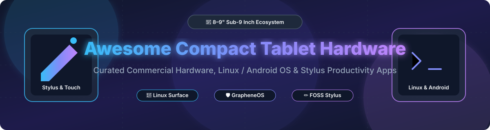

  

<h1 align="center">📱 Awesome Compact Tablet Hardware 📱</h1>

  
  
  
  

  <strong>Curated Directory of Commercial Hardware &amp; Open-Source Software Projects for Compact Tablets (8–9")</strong> 
  <em>Discover top sub-9-inch tablet devices, Linux/Android OS compatibility, privacy-hardened ROMs &amp; stylus note-taking applications.</em>

---

## 💡 Overview & Introduction

Welcome to the definitive guide on **compact tablet hardware** (8–9 inch form factor) and the **open-source software ecosystem** that powers them! Whether you are seeking a high-performance gaming mini tablet, a privacy-focused GrapheneOS/LineageOS slate, or a Linux-surface convertible, this repository indexes commercial hardware and FOSS alternatives.

### 🌟 Key Highlights & Use Cases
- **🎮 Compact Gaming & Portable Power**: High-refresh 8.8" tablets running Snapdragon / Dimensity flagships.
- **🛡️ Privacy & Security Hardening**: Devices with GrapheneOS, LineageOS, and postmarketOS support.
- **✏️ Digital Handwriting & Stylus Note-Taking**: Open-source cross-platform canvas and note apps like Linwood Butterfly and NexaNote.
- **🐧 Mobile Linux**: Microsoft Surface Go & x86/ARM tablet hardware running custom patched Linux kernels.

---

## 📖 Table of Contents

- [🔓 Commercial Hardware & Devices](#-commercial-hardware--devices)
- [☁️ Cloud & SaaS Services Ecosystem](#️-cloud--saas-services-ecosystem)
- [🔓 Open-Source Software Projects](#-open-source-software-projects)
- [🤝 How to Contribute](#-how-to-contribute)
- [⭐ Star History](#-star-history)
- [💖 Support & Sponsorship](#-support--sponsorship)
- [⚠️ Disclaimer](#-disclaimer)

---

## 🔓 Commercial Hardware & Devices

> **📊 Market Context & Dynamics**: The global compact tablet market is estimated at **$18.5 Billion (2026)** and is **highly fragmented** across commercial vendors with proprietary bootloaders. Flagship compact devices offer desktop-grade performance, yet operating system freedom remains restricted to specific platforms (such as Google Pixel or Microsoft Surface lines).

| Hardware Device | Category & Highlights | Pricing (Starting Tier) | Linux/Open-Source Support | Vendor Revenue / Size |
|:---|:---|:---|:---|:---|
| **[Amazon Fire HD 8](https://www.amazon.com/)** 🛒 | Budget Amazon tablet with Fire OS (Android fork). 8" HD screen, expandable SD storage. | **$99.99** (32GB base with ads) | **None** — locked bootloader. Debloating possible via Fire Toolbox. | **~$638B revenue** (Amazon FY2025) |
| **[Apple iPad mini (7th Gen)](https://www.apple.com/ipad-mini/)** 🍏 | **Benchmark compact tablet.** 8.3" Liquid Retina, A17 Pro CPU, Apple Pencil Pro & Apple Intelligence support. | **$499.00** (128GB Wi-Fi model) | **None** — locked bootloader. No Linux kernel execution possible. | **~$400B revenue** (Apple FY2025 est.) |
| **[Pixel Tablet](https://store.google.com/)** 📱 | **GrapheneOS privacy flagship.** 11" IPS, Google Tensor G2 CPU, magnetic speaker dock support. | **$499.00** (128GB Wi-Fi) | **GrapheneOS**: Full official support. **LineageOS**: Officially supported. | **~$350B revenue** (Alphabet FY2025) |
| **[Microsoft Surface Go 4](https://www.microsoft.com/surface/)** 💻 | **Most Linux-friendly Windows tablet.** 10.5" Touchscreen, Intel N200, integrated kickstand. | **$549.00** (64GB UFS / 8GB RAM) | **Linux**: Community supported via **linux-surface** kernel patches (touch, pen, Wi-Fi work). | **~$281B revenue** (Microsoft FY2025) |
| **[Samsung Galaxy Tab A9](https://www.samsung.com/)** 📱 | Budget compact Android tablet. 8.7" LCD, MediaTek Helio G99, microSD slot. | **$169.99** (64GB Wi-Fi) | **LineageOS**: Supported on older Galaxy Tab A 8.0 models; A9 community GSI work ongoing. | **~$250B revenue** (Samsung FY2025 est.) |
| **[HUAWEI MatePad Mini OLED](https://consumer.huawei.com/)** 🎨 | **Lightest OLED tablet.** 260g ultra-lightweight, Kirin 9020 CPU, HarmonyOS 5.1 with stylus support. | **~$650.00** (Estimate, China MSRP) | **None** — HarmonyOS locked bootloader. | **~$100B revenue** (Huawei FY2025 est.) |
| **[Lenovo Legion Y700 (Gen 5)](https://www.lenovo.com/)** 🎮 | **Best compact gaming tablet.** 8.8" 3K 165Hz display, Snapdragon 8 Elite, 9000mAh battery, dual USB-C. | **~$550.00** (Import retail equivalent) | **None** — Ships with ZUI / Android 16. Bootloader locked on global/CN variants. | **~$60B revenue** (Lenovo FY2025 est.) |
| **[Xiaomi Pad Mini](https://www.mi.com/)** ⚡ | **Thinnest flagship compact tablet.** 6.5mm profile, Dimensity 9400+, 3K 165Hz display, 67W fast charging. | **~$520.00** (Estimate, China MSRP) | **None** — HyperOS / Android with restricted bootloader unlock. | **~$40B revenue** (Xiaomi FY2025 est.) |
| **[Alldocube iPlay 50 Mini Pro](https://www.alldocube.com/)** 🛠️ | **Budget 8.4" stock Android tablet.** MediaTek Helio G99, 8GB RAM, 256GB storage, 4G LTE. | **$129.99** (256GB LTE) | **GSI / Treble**: Compatible with Generic System Images (LineageOS GSI / Phh). | **Private OEM** |

---

## ☁️ Cloud & SaaS Services Ecosystem

> **📊 Market Context & Dynamics**: The global cloud note-taking, document reading, and tablet productivity SaaS market is estimated at **$12.2 Billion (2026)** and is **moderately fragmented**, with giant tech platforms competing against specialized, privacy-focused indie platforms.

| SaaS Product / Service ☁️ | Core Capabilities & Functionality 🛠️ | Pricing (Starting Paid Tier) 💳 | Free Tier & Free Trial Limits 🎁 | Vendor Size / Valuation 🏢 |
|:---|:---|:---|:---|:---|
| **[Microsoft 365 Cloud](https://www.microsoft.com/microsoft-365)** | Complete cloud suite (Word, Excel, OneNote cloud sync) optimized for tablet touch & pen input. | **$6.99/month** (Personal Plan) | **Free Tier**: Free Office Web & Mobile apps with 5GB OneDrive storage forever. | **~$3.1 Trillion** (Market Cap) |
| **[Google Workspace](https://workspace.google.com/)** | Cloud document editing, Drive storage, and real-time collaboration with stylus annotations. | **$6.00/user/month** (Business Starter) | **Free Tier**: 15GB free Google Account storage forever across Docs, Sheets, and Drive. | **~$2.2 Trillion** (Market Cap) |
| **[Readest Cloud](https://github.com/bilingify/readest)** | Multi-device ebook reading progress sync, cross-platform highlight backup, and AI translation API access. | **$4.99/month** (Readest Pro Sync) | **Free Tier**: Free forever with local WebDAV / Google Drive self-sync option; 14-day cloud trial. | **Indie SaaS** (~$1M Valuation) |
| **[Butterfly Cloud Workspace](https://github.com/LinwoodCloud/Butterfly)** | Cloud synchronization for infinite canvas handwriting notes and multi-user whiteboard sharing. | **$3.50/month** (Hosted Linwood Sync) | **Free Tier**: Free forever for unlimited local device usage and self-hosted WebDAV sync. | **Indie FOSS SaaS** |

---

## 🔓 Open-Source Software Projects

Sorted by star count (descending). The star badge beside each repo links directly to its stargazers page.

| Repository & Project 🚀 | Description & Features 📝 | Star Badge 🌟 |
|:---|:---|:---|
| **[LineageOS](https://github.com/LineageOS/android)** 📱 | **Leading alternative Android OS.** Brings updated Android releases to legacy compact tablets like Galaxy Tab series. |  |
| **[Readest](https://github.com/bilingify/readest)** 📚 | **Modern open-source ebook reader for tablets & e-ink.** EPUB, PDF, MOBI, AZW3, FB2, CBZ support, dual-page mode, offline TTS. |  |
| **[linux-surface](https://github.com/linux-surface/linux-surface)** 🐧 | **Linux kernel & drivers for Microsoft Surface devices.** Enables full touchscreen, stylus pen, and keyboard support on Surface Go. |  |
| **[Linwood Butterfly](https://github.com/LinwoodCloud/Butterfly)** ✏️ | **Cross-platform open-source note-taking & sketching app.** Infinite canvas, pressure-sensitive stylus support, PDF annotation. |  |
| **[Xournal++](https://github.com/xournalpp/xournalpp)** 🖊️ | **Handwriting note-taking & PDF annotation software.** Optimized for stylus input, pressure sensitivity, and audio recording. |  |
| **[postmarketOS](https://gitlab.com/postmarketOS/pmbootstrap)** 🐧 | **Alpine Linux-based OS for mobile & tablet devices.** Extends the lifespan of 200+ compact mobile devices with main-line Linux. |  |
| **[Episteme Reader](https://github.com/Aryan-Raj3112/episteme)** 📖 | **Offline-first document & comic reader.** Kotlin Multiplatform, PDF ink annotations, text-to-speech, network-stripped FOSS edition. |  |
| **[NexaNote](https://github.com/TheZupZup/NexaNote)** 📝 | **Self-hosted handwriting & stylus note-taking app.** Local-first SQLite storage, REST API / WebDAV sync, Docker support. |  |
| **[Mobian](https://github.com/tabletseeker/mobian)** 🍥 | **Debian GNU/Linux distribution targeted at mobile touch devices.** Full touch UI, on-screen keyboard, Surface Go compatibility. |  |
| **[Ubuntu-Tiny](https://github.com/ghostplant/ubuntu-tiny)** ⚡ | **Lightweight Ubuntu MATE LTS for touch & compact devices.** Tiny memory footprint (570MB desktop), ideal for x86 tablet PCs. |  |
| **[GrapheneOS](https://grapheneos.org/)** 🛡️ | **Hardened privacy-focused mobile OS.** Hardened AOSP, sandboxed Google Play, verified boot. Supports Google Pixel Tablet. |  |
| **[openKylin](https://docs.openkylin.top/)** 🌏 | **Tablet-optimized open-source desktop OS.** Virtual touch keyboard, Android KMRE compatibility, X86/ARM/RISC-V support. |  |

---

## 🤝 How to Contribute

Contributions to expand this list of **compact hardware** and **tablet open-source tools** are welcome!

1. 🍴 **Fork** the repository.
2. 📝 **Add your entry** to `README.md` in the appropriate category following table conventions.
3. 🔗 Ensure links, specs, and star badges are accurate.
4. 🚀 **Open a Pull Request** with a brief summary of the added project/hardware.

If you find this list helpful, please consider **starring** 🌟 the repo to help others discover it!

---

## ⭐ Star History

---

## 💖 Support & Sponsorship

If you find this curated directory useful for your compact tablet setup, consider supporting the maintenance and growth of this open-source resource!

- ⭐ **Star** this repository on GitHub to boost visibility.
- 🔄 **Share** it with fellow tablet enthusiasts, digital note-takers, and Linux users.
- ☕ **Buy me a coffee**: Support ongoing development via the [GitHub Sponsor Dashboard](https://github.com/sponsors/ishandutta2007).

Thank you for your generous support and contributions! ❤️

---

## ⚠️ Disclaimer

- This directory is a **community-curated index** for informational purposes. Inclusion does not imply official endorsement.
- **Hardware Bootloader Limitations**: Modern commercial compact tablets often feature locked bootloaders. Operating systems like GrapheneOS or Linux-surface require specific hardware models (e.g., Pixel Tablet or Microsoft Surface Go). Always verify bootloader status on XDA / official project wiki before purchasing.
- All trademarks and brand names belong to their respective owners.

---

  <em>Maintained with ❤️ for tablet enthusiasts, digital note-takers, and open-source advocates worldwide.</em> 
  <em>See also: <a href="https://github.com/ishandutta2007/Awesome-Awesome-Awesome">Awesome Awesome Awesome</a> list collection.</em>

